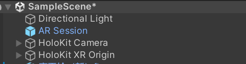

# AR-Festival-Empowers-Cities---Happy-Children-s-Day
“节日赋能城市 - 欢乐儿童节"是一个基于增强现实技术的独特项目，致力于创造一种新颖且可持续的城市体验。这个项目不仅是一个活动，更是一种激发童心的探索。通过AR技术，成年人和儿童都可以重新连接他们的童年梦想与回忆，在城市中体验奇妙的互动。  该项目的核心目标是为城市注入新活力，激发每个人心中的好奇心与欢乐感。通过AR体验，参与者无论年龄大小，都可以再次找回属于“小孩”的纯真与快乐。这个项目为城市注入新的创意动力，将节日气氛带给每个人。
## 以AR的形式给节日赋能的意义  

创新体验： 增强现实技术可以为城市节日带来创新的体验和互动方式。通过AR，人们可以与虚拟元素进行互动，从而丰富了他们的节日体验。
增强城市吸引力： 利用AR技术为城市节日增添视觉上的吸引力，吸引更多游客和居民参与活动。这有助于提升城市的知名度和吸引力。
社交互动： AR可以促进人们之间的社交互动，使节日活动更具参与性和互动性。例如，人们可以在AR应用中分享他们的体验，与朋友互动，并创建共享的记忆。
提升城市形象： 通过运用AR技术丰富儿童节活动，城市可以提升自身形象，吸引更多家庭前来参与活动，增加游客流量，从而促进城市经济和旅游业的发展。
## 主要功能
AR体验：用户可以通过手机端的AR技术，与城市中的各种虚拟元素互动。
手势识别：通过先进的手势识别技术，用户能够自然地与AR场景中的对象进行交互。
场景交互：设计多种互动场景，每个场景都与特定的童年回忆或梦想相关联，增强用户的沉浸感。
## 技术栈
建模与贴图：Blender、RizomUV、Substance Painter
游戏引擎：Unity (URP 管线)
增强现实框架：ARKit
## 功能亮点
快速平面检测
场景理解和环境映射
3D 对象检测
现实与虚拟对象的交互
## 它是如何工作的
在这个项目中，我们使用Holokit手势追踪与手势识别，根据Holokit教程进项相关设置

### UI
在UI中，我们得到了一个称为HoloKit UI Canvas的Canvas和一个事件系统Object。

### 设定
我们使用“Directional LIght”对象设置场景的主光。。AR Session和XR Origin是在Unity中创建AR体验的基础。

## 交互设置
### 传送门
逻辑：设置跟随TriggerDetection按顺序碰撞target1、target2、target3物体四开始运动
在Unity场景中创建一个空物体（TriggerDetection）作为跟随鼠标的对象。
创建一个C#脚本，命名为"Trigger Detection.cs"，将其附加到空物体上。
在脚本中编写代码，使空物体跟随鼠标移动。可以使用Input.mousePosition来获取鼠标位置，并使用Camera.main.ScreenToWorldPoint将屏幕坐标转换为世界坐标。
在场景中创建target1、target2、target3等目标物体，分别放置同一平面的不同的位置。
编写碰撞逻辑，将target1、target2、target3对应挂在相应位置
在空物体的脚本中，编写碰撞逻辑。使用OnCollisionEnter方法检测碰撞，并按照预期的顺序检测目标物体的碰撞。

### 场景内的撞击交互
小音箱涉及与上述跟随鼠标的空物体进行碰撞开始运动＋播放声音
先建立一个负责碰撞的空物体，将音响的模型作为它的子集

当空物体与音响空物体撞击就开始运动并播放声音
整体设置：

设置Trigger动画让物体接收到先关指令后才可开始运动

### 其他
其中小装置与旋转木马的思路与小音箱是相同的，其中糖果树的小熊是在撞击后跟随空物体运动（增加一个Follow Mouse（Script）

>注：每个物体都要添加碰撞组件

### 调整交互顺序
我们的设计是打开场景后进入UI界面，点击开始后为空场景，当画出指定手势后出现大场景，传送门与过山车开始运动。当碰撞制定物体后该物体按照原设定方式运动。
新建一个场景集合sence，除target1、target2、target3物体都移入集合sence，并赋予脚本命令只有当空物体按顺序撞击target1、target2、target3，sence才可出现

设置脚本，在inspector将相关设定也挂入Trigger Detection

### 手势交互
以上测试成功后，将空物体挂上Hand Tracking Manager组件并进行调试
测试：

## 使用示例
传送门
小装置
旋转木马
音响

