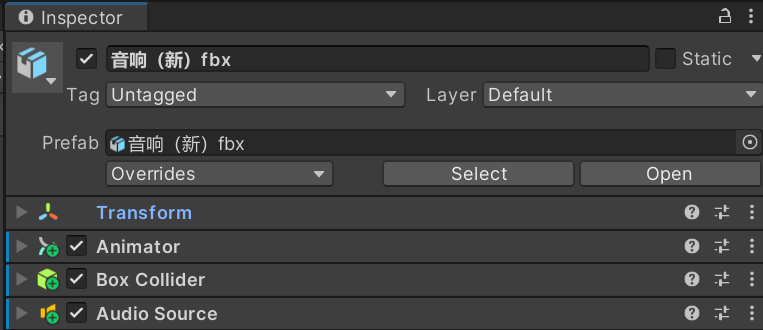
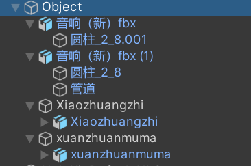
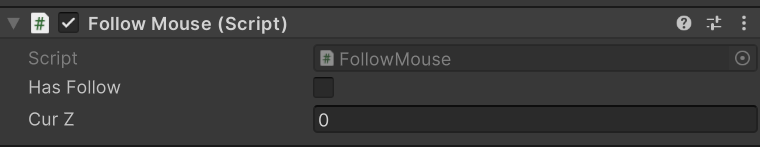
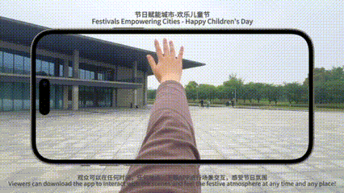
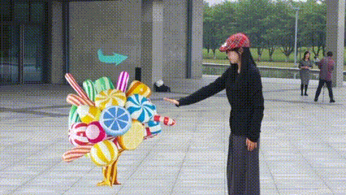
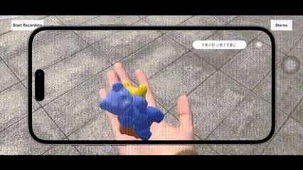
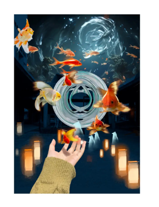

# AR-Festival-Empowers-Cities---Happy-Children-s-Day
“节日赋能城市 - 欢乐儿童节"是一个基于增强现实技术的独特项目，致力于创造一种新颖且可持续的城市体验。这个项目不仅是一个活动，更是一种激发童心的探索。通过AR技术，成年人和儿童都可以重新连接他们的童年梦想与回忆，在城市中体验奇妙的互动。  该项目的核心目标是为城市注入新活力，激发每个人心中的好奇心与欢乐感。通过AR体验，参与者无论年龄大小，都可以再次找回属于“小孩”的纯真与快乐。这个项目为城市注入新的创意动力，将节日气氛带给每个人。

"Festival Empowering City - Happy Children's Day" is a unique project based on augmented reality technology, committed to creating a novel and sustainable urban experience. This project is not only an activity, but also an exploration that inspires childlike innocence. Through AR technology, adults and children can reconnect their childhood dreams and memories, and experience wonderful interactions in the city. The core goal of this project is to inject new vitality into the city, stimulate everyone's curiosity and sense of joy. Through AR experience, participants, regardless of age, can rediscover the innocence and happiness belonging to "children". This project injects new creative energy into the city and brings the festive atmosphere to everyone.
## 以AR的形式给节日赋能的意义  

创新体验： 增强现实技术可以为城市节日带来创新的体验和互动方式。通过AR，人们可以与虚拟元素进行互动，从而丰富了他们的节日体验。
增强城市吸引力： 利用AR技术为城市节日增添视觉上的吸引力，吸引更多游客和居民参与活动。这有助于提升城市的知名度和吸引力。
社交互动： AR可以促进人们之间的社交互动，使节日活动更具参与性和互动性。例如，人们可以在AR应用中分享他们的体验，与朋友互动，并创建共享的记忆。
提升城市形象： 通过运用AR技术丰富儿童节活动，城市可以提升自身形象，吸引更多家庭前来参与活动，增加游客流量，从而促进城市经济和旅游业的发展。

Innovative experience: Augmented reality technology can bring innovative experiences and interactive ways for urban festivals. Through AR, people can interact with virtual elements, enriching their holiday experience.
Enhancing urban attractiveness: Using AR technology to add visual appeal to urban festivals, attracting more tourists and residents to participate in activities. This helps to enhance the city's visibility and attractiveness.
Social interaction: AR can promote social interaction between people, making festival activities more participatory and interactive. For example, people can share their experiences, interact with friends, and create shared memories in AR applications.
Enhancing City Image: By utilizing AR technology to enrich Children's Day activities, cities can enhance their own image, attract more families to participate in activities, increase tourist traffic, and promote the development of the city's economy and tourism industry.
## 主要功能
AR体验：用户可以通过手机端的AR技术，与城市中的各种虚拟元素互动。
手势识别：通过先进的手势识别技术，用户能够自然地与AR场景中的对象进行交互。
场景交互：设计多种互动场景，每个场景都与特定的童年回忆或梦想相关联，增强用户的沉浸感。

AR experience: Users can interact with various virtual elements in the city through AR technology on their mobile devices.
Gesture recognition: With advanced gesture recognition technology, users can naturally interact with objects in AR scenes.
Scene interaction: Design multiple interactive scenes, each associated with specific childhood memories or dreams, to enhance user immersion.
## 技术栈
建模与贴图：Blender、RizomUV、Substance Painter
游戏引擎：Unity (URP 管线)
增强现实框架：ARKit

Modeling and mapping: Blender, RizomUV, Substance Painter
Game engine: Unity (URP pipeline)
Augmented Reality Framework: ARKit
## 功能亮点
快速平面检测
场景理解和环境映射
3D 对象检测
现实与虚拟对象的交互

Quick plane detection
Scene understanding and environmental mapping
3D object detection
The interaction between reality and virtual objects
## 它是如何工作的
在这个项目中，我们使用Holokit手势追踪与手势识别，根据Holokit教程进项相关设置

In this project, we use Holokit gesture tracking and gesture recognition, and input relevant settings according to the Holokit tutorial

### UI
在UI中，我们得到了一个称为HoloKit UI Canvas的Canvas和一个事件系统Object。

In the UI, we have a Canvas called HoloKit UI Canvas and an Event System Object.

### 设定
我们使用“Directional LIght”对象设置场景的主光。。AR Session和XR Origin是在Unity中创建AR体验的基础。

We use the "Directional Light" object to set the main light of the scene.. AR Session and XR Origin are the foundation for creating AR experiences in Unity.

## 交互设置
### 传送门
逻辑：设置跟随TriggerDetection按顺序碰撞target1、target2、target3物体四开始运动
在Unity场景中创建一个空物体（TriggerDetection）作为跟随鼠标的对象。
创建一个C#脚本，命名为"Trigger Detection.cs"，将其附加到空物体上。
在脚本中编写代码，使空物体跟随鼠标移动。可以使用Input.mousePosition来获取鼠标位置，并使用Camera.main.ScreenToWorldPoint将屏幕坐标转换为世界坐标。
在场景中创建target1、target2、target3等目标物体，分别放置同一平面的不同的位置。
编写碰撞逻辑，将target1、target2、target3对应挂在相应位置
在空物体的脚本中，编写碰撞逻辑。使用OnCollisionEnter方法检测碰撞，并按照预期的顺序检测目标物体的碰撞。

Logic: Set to follow TriggerDetection and collide with target1, target2, and target3 objects in order to start moving four times
Create an empty object (TriggerDetection) in the Unity scene as the object to follow the mouse.
Create a C # script named "Trigger Detection. cs" and attach it to an empty object.
Write code in the script to make empty objects follow the movement of the mouse. You can use Input. mousePosition to obtain the mouse position and use Camera.main ScreenToWorldPoint converts screen coordinates to world coordinates.
Create target objects such as target1, target2, and target3 in the scene, and place them in different positions on the same plane.
Write collision logic and hang target1, target2, and target3 in corresponding positions
Write collision logic in scripts for empty objects. Use the OnCollisionEnter method to detect collisions and detect collisions of target objects in the expected order.

### 场景内的撞击交互
小音箱涉及与上述跟随鼠标的空物体进行碰撞开始运动＋播放声音
先建立一个负责碰撞的空物体，将音响的模型作为它的子集

The small speaker involves colliding with the empty object following the mouse mentioned above to start moving and playing sound
First, establish an empty object responsible for collision, and use the audio model as a subset of it

当空物体与音响空物体撞击就开始运动并播放声音
整体设置：

When an empty object collides with a sound system, it starts moving and plays sound
Overall settings:

设置Trigger动画让物体接收到先关指令后才可开始运动

Set Trigger animation so that objects receive a close command before they can start moving

### 其他
其中小装置与旋转木马的思路与小音箱是相同的，其中糖果树的小熊是在撞击后跟随空物体运动（增加一个Follow Mouse（Script）

The idea of the small device and carousel is the same as that of the small speaker, where the candy tree's bear follows the movement of an empty object after impact (adding a Follow Mouse (Script))

>注：每个物体都要添加碰撞组件

>Note: Each object needs to add collision components

### 调整交互顺序
我们的设计是打开场景后进入UI界面，点击开始后为空场景，当画出指定手势后出现大场景，传送门与过山车开始运动。当碰撞制定物体后该物体按照原设定方式运动。
新建一个场景集合sence，除target1、target2、target3物体都移入集合sence，并赋予脚本命令只有当空物体按顺序撞击target1、target2、target3，sence才可出现

Our design is to open the scene and enter the UI interface. After clicking start, the scene becomes empty. When a specified gesture is drawn, a large scene appears, and the portal and roller coaster start moving. When an object collides, it moves in its original way.
Create a new scene collection sense, move all objects except target1, target2, and target3 into the set sense, and assign the script command that only when empty objects collide with target1, target2, and target3 in order, sense can appear

设置脚本，在inspector将相关设定也挂入Trigger Detection

Set up a script to also hook the relevant settings into Trigger Detection in the inspector

### 手势交互
以上测试成功后，将空物体挂上Hand Tracking Manager组件并进行调试

After the above test is successful, hang the empty object onto the Hand Tracking Manager component and debug it

## 使用示例
🚪传送门

🌲树

🐻小熊

## 项目愿景
### 出发点
减淡的节日氛围： 随着生活节奏的加快和城市化进程的推进，许多传统节日的庆祝方式和氛围逐渐减淡，导致节日文化的流失和市民参与热情的降低。这个项目通过增强现实技术，为城市注入新的节日活力，让传统节日更加生动丰富，激发市民和游客的参与热情。

城市文化软实力提升： 城市的文化软实力是吸引人才、投资和游客的重要因素之一。通过打造具有独特文化特色的AR节日体验，可以提升城市的文化软实力，增强城市的吸引力和竞争力。

科技与文化融合创新： AR技术作为一种前沿科技，与传统文化元素的融合创新，将为城市带来全新的文化体验和发展模式，推动科技与文化的融合发展，为城市创新发展注入新的动力。推动AR技术在城市景观设计和文化传播领域的应用，促进科技与文化的融合发展。

Reduced festive atmosphere: With the acceleration of life pace and the advancement of urbanization, the celebration methods and atmosphere of many traditional festivals are gradually decreasing, leading to the loss of festival culture and a decrease in the enthusiasm of citizens to participate. This project injects new festive vitality into the city through augmented reality technology, making traditional festivals more vivid and rich, and stimulating the enthusiasm of citizens and tourists to participate.

Enhancement of urban cultural soft power: The cultural soft power of a city is one of the important factors in attracting talent, investment, and tourists. By creating AR festival experiences with unique cultural characteristics, the cultural soft power of a city can be enhanced, enhancing its attractiveness and competitiveness.

Integration and Innovation of Technology and Culture: AR technology, as a cutting-edge technology, integrating and innovating with traditional cultural elements, will bring new cultural experiences and development models to cities, promote the integration and development of technology and culture, and inject new impetus into urban innovation and development. Promote the application of AR technology in urban landscape design and cultural dissemination, and promote the integration and development of technology and culture.
### 项目未来发展
针对其他节日的内容开发，可以根据具体的节日主题和文化传统设计相应的AR赋能内容。

For the development of content for other festivals, corresponding AR empowerment content can be designed based on specific festival themes and cultural traditions.

